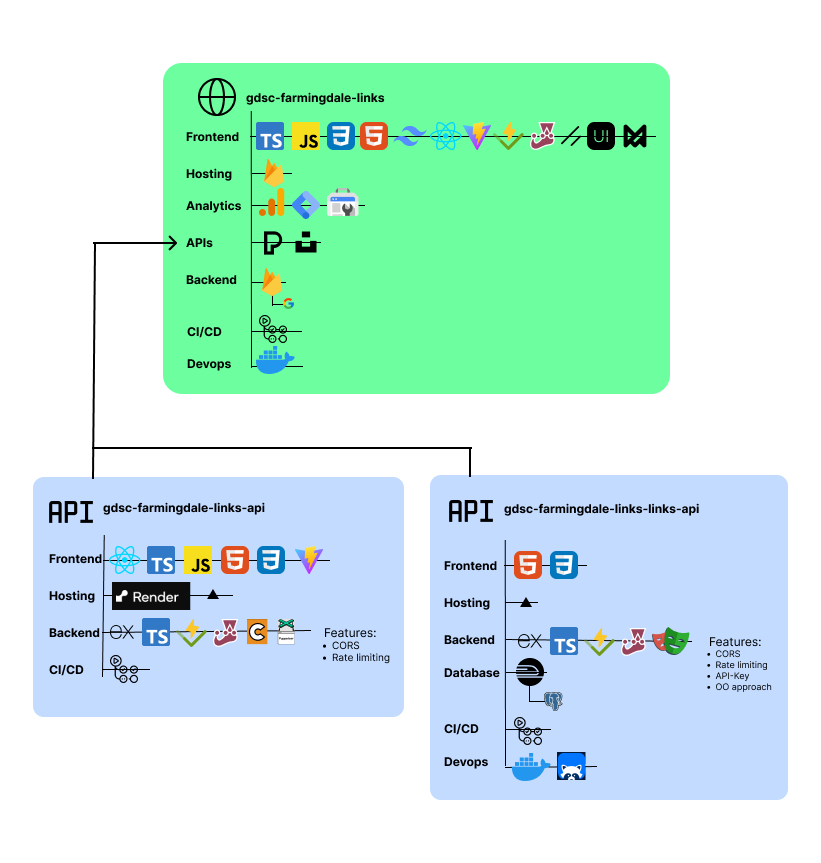

# GDSC Farmingdale Links


Welcome to GDSC Farmingdale Links, your go-to portal for staying updated on GDSC Farmingdale events. This project fetches data from the [Links API](https://github.com/GDSC-FSC/gdsc-farmingdale-links-api) and [Links Links API](https://github.com/WomB0ComB0/gdsc-farmingdale-links-links-api) which presents them through an intuitive and interactive user interface.

## Diagram



## Features

- Fetches GDSC Farmingdale events dynamically from the dedicated API.
- Responsive user interface crafted with React.
- Developed with modern tools including Vite and TypeScript.
- Designed to adapt seamlessly across various devices.

## Prerequisites

Before you get started, ensure you have the following prerequisites installed:

- Git: [Download](https://git-scm.com/downloads)
- Node.js: [Download](https://nodejs.org/)
- npm: [Download](https://www.npmjs.com/)

## Setup & Installation

1. Clone the repository:

    ```bash
    git clone https://github.com/GDSC-FSC/gdsc-farmingdale-links
    ```

2. Navigate to the directory:

    ```bash
    cd gdsc-farmingdale-links
   ```

3. Install the required dependencies:

    ```bash
    npm install
    ```

4. Start the development server:

    ```bash
    npm run dev
    ```

Access the application at `http://localhost:5173` in your web browser.

## Contributing

We welcome contributions via pull requests. If you're considering major changes, please open an issue first to discuss them.

## Acknowledgements

This project utilizes various libraries and tools including:

- [React](https://reactjs.org/)
- [Vite](https://vitejs.dev/)
- [TypeScript](https://www.typescriptlang.org/)
- [tailwindcss](https://tailwindcss.com/)

For a full list, refer to the project's [package.json](package.json) file.

## License

Licensed under the MIT License. See the [LICENSE](LICENSE) file for details.

## Additional Information

### Main Website

Explore the main website for GDSC Farmingdale Links on [GitHub](https://github.com/GDSC-FSC/gdsc-farmingdale-links)!

### Key Features

- **Dynamic Frontend:** Utilizing a sleek combination of Vite, React, TypeScript, HTML, CSS, and Tailwind CSS.
- **Interactive Components:** Smooth animations and thorough testing facilitated by Vitest, Jest, Shadcn-ui, NextUI, and Framer Motion.
- **Analytics Integration:** Google Analytics, Search Console, and Tag Manager monitor user activity, hosted with Firebase.
- **Rich Media Experience:** Stunning visuals courtesy of Pexels and Unsplash APIs.
- **Secure Authentication:** Seamless authentication via Firebase, supporting both anonymous and Google sign-ins.
- **Efficient Workflow:** GitHub Actions streamline the CI/CD pipeline.
- **Containerized Deployment:** Docker Compose ensures easy deployment, with the container available on [Docker Hub](https://hub.docker.com/repository/docker/womb0comb0/gdsc-farmingdale-links/general).

### Web Service

Check out the SSR-enabled web service at [WomB0ComB0/gdsc-farmingdale-links-api](https://github.com/WomB0ComB0/gdsc-farmingdale-links-api)!

### Key Features

- **Server-Side Rendering:** Lightning-fast performance powered by Vite, React, TypeScript, and Express.
- **Robust Backend:** TypeScript, Vitest, Jest, Cheerio, and Puppeteer combine for comprehensive web scraping.
- **Reliable Hosting:** Vercel and Render provide optimal uptime and scalability.

### Advanced Web Service

Discover the advanced web service at [WomB0ComB0/gdsc-farmingdale-links-links-api](https://github.com/WomB0ComB0/gdsc-farmingdale-links-links-api)!

### Key Features

- **Object-Oriented Design:** Express TypeScript backend with Railway as a PostgreSQL provider.
- **Interactive Frontend:** HTML and CSS frontend supporting CRUD operations, hosted on Vercel.
- **Comprehensive Testing:** Vitest, Jest, and Playwright ensure robust functionality.
- **DevOps Excellence:** Docker Compose and Checkly for efficient monitoring and maintenance.
